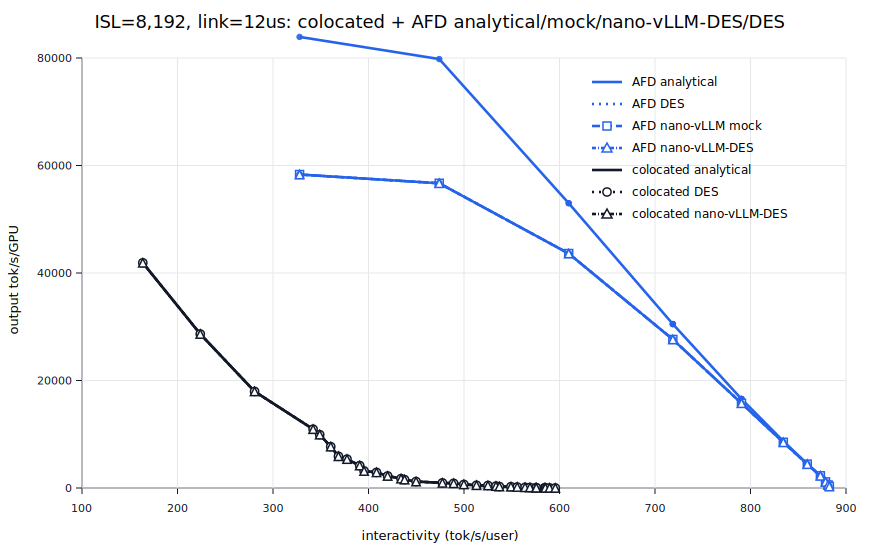
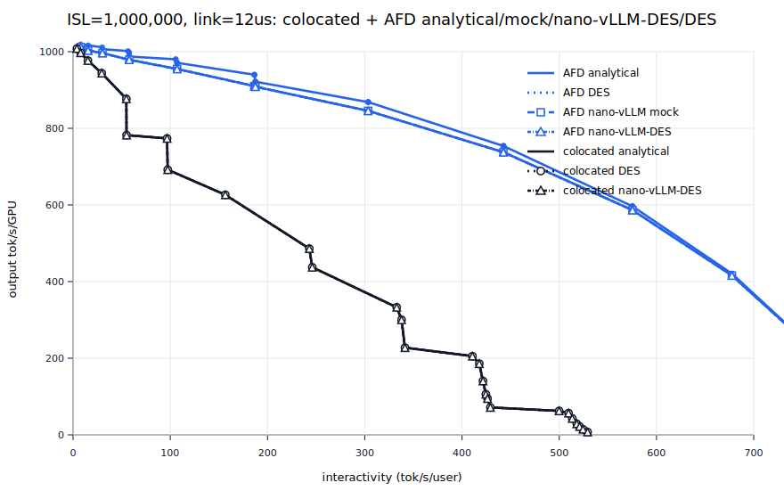

<p align="center">

</p>

<p align="center">
<a href="https://trendshift.io/repositories/15323" target="_blank"></a>
</p>

# Nano-vLLM

A lightweight vLLM implementation built from scratch.

## Fork Summary

This fork keeps the original nano-vLLM implementation and adds a CPU/Mac
serving-simulation stack for studying scheduler behavior and AFD-style serving
without CUDA.

It includes:

- **CPU mock backend**: runs nano-vLLM request lifecycle, scheduler, batching,
  sequence state, and KV/block accounting with deterministic fake tokens.
- **Virtual-time tracing**: emits request, prefill, decode, token, finish, and
  KV events without using `sleep()`.
- **AFD timing modes**: models decode as GPU attention, GPU-to-CS link, CS rest,
  and CS-to-GPU link stages.
- **DES timing paths**: a standalone discrete-event harness plus an
  in-engine `mock_runner="des"` runner that replays each nano-vLLM scheduled
  decode batch through DES resource timing.
- **Timing backends**: simple parametric timing plus a GPT-OSS roofline adapter
  derived from the [original analytical model](docs/perf_model.pdf).
- **Metrics and workload tools**: trace metrics, synthetic workload generation,
  and SVG/CSV result artifacts.
- **Validation plots**: reproduced 8K and 1M ISL analytical / nano-vLLM mock /
  nano-vLLM-DES / standalone DES comparison plots under
  `results/roofline_validation/`.

The original GPU inference path is still present; the mock/DES additions are
for learning, validation, and performance-model exploration.

## Key Features

* 🚀 **Fast offline inference** - Comparable inference speeds to vLLM
* 📖 **Readable codebase** - Clean implementation in ~ 1,200 lines of Python code
* ⚡ **Optimization Suite** - Prefix caching, Tensor Parallelism, Torch compilation, CUDA graph, etc.

## Installation

```bash
pip install git+https://github.com/GeeeekExplorer/nano-vllm.git
```

## Model Download

To download the model weights manually, use the following command:
```bash
huggingface-cli download --resume-download Qwen/Qwen3-0.6B \
  --local-dir ~/huggingface/Qwen3-0.6B/ \
  --local-dir-use-symlinks False
```

## Quick Start

See `example.py` for usage. The API mirrors vLLM's interface with minor differences in the `LLM.generate` method:
```python
from nanovllm import LLM, SamplingParams
llm = LLM("/YOUR/MODEL/PATH", enforce_eager=True, tensor_parallel_size=1)
sampling_params = SamplingParams(temperature=0.6, max_tokens=256)
prompts = ["Hello, Nano-vLLM."]
outputs = llm.generate(prompts, sampling_params)
outputs[0]["text"]
```

## Benchmark

See `bench.py` for benchmark.

**Test Configuration:**
- Hardware: RTX 4070 Laptop (8GB)
- Model: Qwen3-0.6B
- Total Requests: 256 sequences
- Input Length: Randomly sampled between 100–1024 tokens
- Output Length: Randomly sampled between 100–1024 tokens

**Performance Results:**
| Inference Engine | Output Tokens | Time (s) | Throughput (tokens/s) |
|----------------|-------------|----------|-----------------------|
| vLLM           | 133,966     | 98.37    | 1361.84               |
| Nano-vLLM      | 133,966     | 93.41    | 1434.13               |

## CPU Mock Serving Simulator

This fork includes a CPU/Mac-runnable mock backend for learning and validating
serving flow without CUDA, model weights, NCCL, flash-attn, or Triton.

The mock path keeps nano-vLLM's request lifecycle, scheduler, batching,
sequence state, and KV/block manager active. It replaces model execution with
deterministic token generation and virtual latency.

### Mac Setup

Use Python 3.10 or newer. The default macOS `/usr/bin/python3` may be too old.

```bash
python3.12 -m venv .venv
source .venv/bin/activate
pip install -e ".[dev]"
```

Optional analysis packages:

```bash
pip install pandas matplotlib rich
```

Run tests:

```bash
python -m pytest tests/mock_backend
```

### Single Synthetic Trace

Colocated decode:

```bash
python tools/run_mock_trace.py \
  --mock-backend \
  --mock-mode colocated \
  --virtual-time \
  --trace-output traces/mock_trace.csv \
  --num-requests 1 \
  --isl 128 \
  --osl 8
```

AFD sequential decode:

```bash
python tools/run_mock_trace.py \
  --mock-mode afd \
  --pipeline-mode sequential \
  --trace-output traces/mock_afd_trace.csv \
  --num-requests 1 \
  --isl 128 \
  --osl 8
```

DES-backed nano-vLLM decode runner:

```bash
python tools/run_mock_trace.py \
  --mock-mode afd \
  --mock-runner des \
  --timing-backend gptoss_roofline \
  --trace-output traces/mock_afd_des_trace.csv \
  --num-requests 16 \
  --isl 8192 \
  --osl 8
```

AFD ideal pipeline:

```bash
python tools/run_mock_trace.py \
  --mock-mode afd \
  --pipeline-mode ideal_pipeline \
  --microbatch-size 4 \
  --trace-output traces/mock_afd_pipeline_trace.csv \
  --num-requests 16 \
  --arrivals-ms 0 \
  --isl 128 \
  --osl 8
```

Metrics:

```bash
python tools/mock_trace_metrics.py traces/mock_trace.csv \
  --csv-output traces/mock_metrics.csv
```

### Synthetic Workloads

Colocated burst:

```bash
python tools/run_mock_workload.py \
  --mode colocated \
  --num-requests 32 \
  --arrival-process burst \
  --fixed-isl 128 \
  --fixed-osl 8
```

AFD workload:

```bash
python tools/run_mock_workload.py \
  --mode afd \
  --pipeline-mode ideal_pipeline \
  --microbatch-size 4 \
  --num-requests 64 \
  --arrival-process poisson \
  --arrival-rate-per-s 20 \
  --isl-dist lognormal \
  --osl-dist lognormal
```

Workload outputs include trace CSV, metrics CSV, summary CSV, and SVG plots for
TTFT, TBT, throughput, KV usage, and batch size.

### GPT-OSS Timing Backend

The default timing backend is `parametric`, which preserves the original mock
latency formulas. For GPT-OSS-120B decode studies, use
`--timing-backend gptoss_roofline`. It maps the
[original analytical model](docs/perf_model.pdf) decode equations onto the
same mock stages: GPU-only decode for colocated mode, and GPU attention /
GPU↔CS link / CS rest for AFD mode. Prefill remains parametric.

```bash
python tools/run_mock_trace.py \
  --mock-mode afd \
  --timing-backend gptoss_roofline \
  --isl 8192 \
  --osl 8 \
  --trace-output traces/gptoss_afd_trace.csv

python tools/validate_roofline_backend.py \
  --output-dir results/roofline_validation
```

### DES Harness And nano-vLLM-DES Runner

The standalone DES harness lives in `nanovllm/mock/des_engine.py` and is run
through `tools/run_des_workload.py`. It models serving as a discrete-event
system instead of advancing time inside `LLMEngine.step()`.

```text
event queue -> resource queue -> completion event -> next resource
```

In AFD mode, decode work flows through explicit resources:

```text
GPU attention -> GPU-to-CS link -> CS rest -> CS-to-GPU link -> token emit
```

This makes DES useful for questions that the in-engine mock intentionally keeps
simple: multiple attention replicas, shared links, CS queueing, finite
microbatch effects, and large-context replay where ISL/KV are represented as
scalar counts instead of materialized prompt token arrays.

Run a DES AFD workload:

```bash
python tools/run_des_workload.py \
  --mode afd \
  --num-requests 16 \
  --arrival-process burst \
  --attention-replicas 2 \
  --gpu-to-cs-link-resources 1 \
  --cs-rest-resources 1 \
  --cs-to-gpu-link-resources 1
```

Run GPU-only batched DES decode for Pareto-style comparison:

```bash
python tools/run_des_workload.py \
  --mode colocated \
  --des-batch-decode \
  --des-max-batch-size 256 \
  --timing-backend gptoss_roofline \
  --fixed-isl 8192 \
  --fixed-osl 8 \
  --num-requests 256 \
  --prefill-base-ms 0 \
  --prefill-ms-per-token 0
```

This branch also adds an in-engine DES runner selected with
`--mock-runner des` or `mock_runner="des"`. That path still enters through
`LLMEngine.step()`, `Scheduler.schedule()`, nano-vLLM sequence state, and
block/KV admission. When the scheduler returns a decode batch, the runner
hands that scheduled batch to `DESEngine` for colocated or AFD resource timing,
then returns deterministic fake token IDs to the normal nano-vLLM postprocess
path.

The in-engine path is labeled **nano-vLLM-DES** in plots. It is a bridge between
the lifecycle-accurate mock and the resource-accurate standalone DES harness:
it reuses nano-vLLM front-end scheduling, but it does not yet replace
`LLMEngine.step()` with a global event loop or give every AFD role its own
independent scheduler inside nano-vLLM.

Current DES boundaries:

- Standalone DES is based on nano-vLLM serving concepts, but does not call
  `LLMEngine.step()`, `Scheduler.schedule()`, or `BlockManager`.
- nano-vLLM-DES does call the engine/scheduler/block-manager path, but DES
  timing is scoped to each scheduled decode batch.
- KV accounting is scalar token/block accounting, not the exact nano-vLLM block
  table inside standalone DES. nano-vLLM-DES keeps the real mock block-manager
  path for admission and release.
- The in-engine mock is still the path for validating nano-vLLM lifecycle and
  scheduler behavior.
- DES is the path for explicit resource contention, overlap, and large-context
  timing studies.

Planned direct nano-vLLM integration:

1. Reuse nano-vLLM `Sequence` and block-manager state for admission, append,
   preemption, and release decisions.
2. Add role-specific queues for attention, GPU-to-CS link, CS rest, and
   CS-to-GPU link so AFD stages can batch independently.
3. Replace the batch-scoped DES bridge with a global event loop when studying
   true cross-request overlap inside the engine.
4. Keep the standalone DES harness as a fast reference and regression oracle
   for resource scheduling experiments.

More detail lives in `docs/des_harness.md`.

### Analytical, Mock, And DES Comparisons

The repository now has three timing paths:

- **Analytical**: closed-form roofline / Frontier-style Pareto model.
- **nano-vLLM mock**: the in-engine fake backend that keeps nano-vLLM request,
  scheduler, and block-manager flow where practical.
- **nano-vLLM-DES**: the in-engine DES runner that keeps nano-vLLM scheduling
  and block/KV paths, then times each scheduled decode batch with DES.
- **DES**: a standalone discrete-event simulator with scalar request/KV state
  and explicit attention, link, and CS resources.

Standalone DES is intentionally separate from `LLMEngine.step()`. The in-engine
mock and nano-vLLM-DES paths are best for validating nano-vLLM lifecycle
behavior, while standalone DES is best for resource-level AFD studies and
large-context replay without materializing prompt token arrays.

Reproduce the 8K ISL AFD comparison:

```bash
python tools/validate_afd_pareto.py \
  --output-dir results/roofline_validation/afd_pareto_sim
```

Reproduce the 1M ISL comparison:

```bash
python tools/validate_afd_pareto.py \
  --isl 1000000 \
  --link-us 12 \
  --output-dir results/roofline_validation/afd_pareto_1m
```

The generated artifacts are documented in
`results/roofline_validation/README.md`.

8K ISL, link=12us:



1M ISL, link=12us:



### What Is Real

- `LLMEngine.step()` and the request lifecycle.
- `Scheduler.schedule()` batching, prefill/decode selection, queueing, and
  preemption behavior.
- `Sequence` token state.
- `BlockManager` allocation, append, deallocation, and prefix-cache hashing.
- Trace and metrics generation from virtual-time events.

### What Is Mocked

- Model weights and real logits.
- CUDA tensors, CUDA graphs, NCCL, Triton, and flash-attn.
- Token generation, which is deterministic dummy token IDs.
- Latency, which is virtual time rather than `sleep()`.
- AFD CS execution, which contributes timing but holds no KV.

### What Is Not Validated

- Numerical model correctness.
- Real GPU/CS kernel behavior.
- Real network or PCIe/NIC behavior.
- Real tokenizer/model compatibility in mock mode.
- Production vLLM API serving or HTTP behavior.

### How To Interpret Results

Trace timestamps are virtual milliseconds. Wall-clock runtime of the simulator
is unrelated to modeled serving latency.

Colocated mode uses:

```text
prefill_ms = prefill_base_ms + isl * prefill_ms_per_token * batch_size
decode_ms = decode_base_ms + decode_ms_per_token * batch_size
```

AFD sequential mode uses:

```text
attention -> GPU-to-CS link -> CS rest -> CS-to-GPU link
```

AFD ideal pipeline mode is an optimistic steady-state model. For small
microbatch counts, use `pipeline_mode=discrete_pipeline` or the
`pipeline_sim.py` tests as the stricter event-level reference.

More detail lives in `docs/mock_backend.md`.


## Star History

[](https://www.star-history.com/#GeeeekExplorer/nano-vllm&Date)
